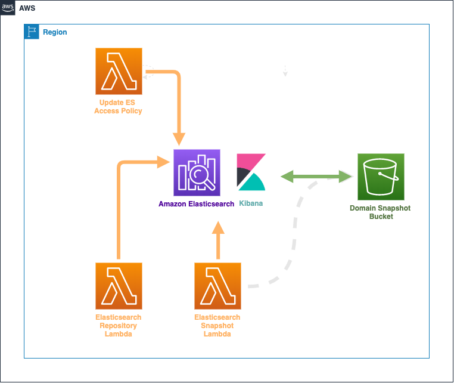
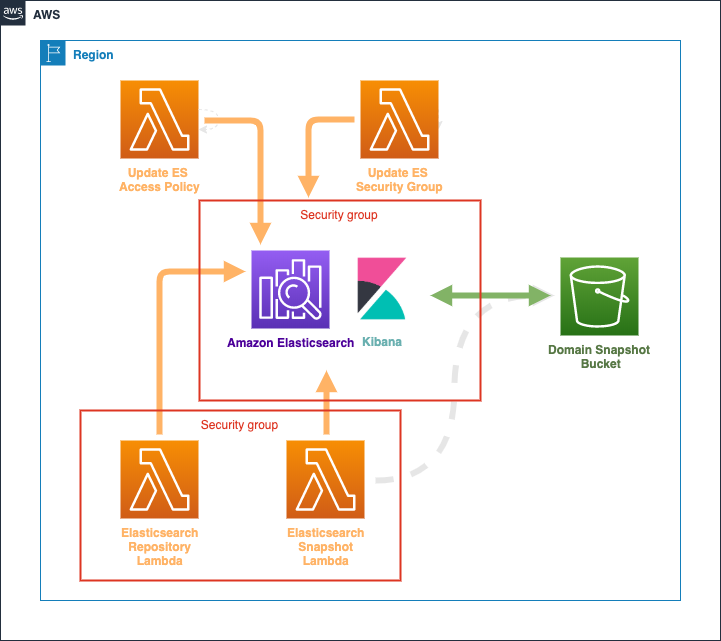

# Custom Scheduled Elasticsearch Domain Snapshots
---
This template is used to create a stack that implements Elasticsearch Snapshots on a custom schedule, configurable for both Public and VPC Elasticsearch Domains, and allows administrators more fine-grained control and visibility over snapshots.


### Public (Non-VPC) Elasticsearch Domains
The following actions are taken on your domain when this template is deployed:
1. Access policies are updated to allow least privileged access to the Lambda functions that will:
    1. Create a Snapshot Repository (one time)
    1. Create incremental snapshots at the specified intervals (See [Parameters](#parameters-span-idparametersspan))
1. A new Snapshot Repository is created and associated with a new S3 bucket
    - _Please update the template with any access/control policies that you require on buckets. It is currently a generic bucket with very few security measures in place._
1. A CloudWatch Event Rule is set up on your desired interval which triggers a Lambda function to create new Elasticsearch Snapshots, which are then located in the above-mentioned bucket/snapshot repository.



### VPC Elasticsearch Domains
The following actions are taken on your domain when this template is deployed:
1. Access policies are updated to allow least privileged access to the Lambda functions that will:
    1. Create a Snapshot Repository (one time)
    1. Create incremental snapshots at the specified intervals (See [Parameters](#parameters-span-idparametersspan))
1. Elasticsearch Domain Security Group is updated to allow ingress from the Security Group attached to the Lambda functions that will:
    1. Create a Snapshot Repository (one time)
    1. Create incremental snapshots at the specified intervals
1. A new Snapshot Repository is created and associated with a new S3 bucket
    - _Please update the template with any access/control policies that you require on buckets. It is currently a generic bucket with very few security measures in place._
1. A CloudWatch Event Rule is set up on your desired interval which triggers a Lambda function to create new Elasticsearch Snapshots, which are then located in the above-mentioned bucket/snapshot repository.



<br /><br />

## Getting Started
---

### Credentials
This project takes advantage of the AWS CLI to package and deploy the template. A set of CLI credentials (*AccessKey and SecretKey*) with permissions to deploy all of the resources defined in the template is required.

<br /><br />

## Prerequisites
---

* Installing AWS CLI:  https://docs.aws.amazon.com/cli/latest/userguide/cli-chap-install.html
* Configuring AWS CLI: https://docs.aws.amazon.com/cli/latest/userguide/cli-chap-configure.html
* Pre-built S3 bucket that can be used for caching the Lambda artifacts during packaging and deployment
* (VPC-located ES Domains ONly) [VPC S3 Endpoint](https://docs.aws.amazon.com/vpc/latest/userguide/vpc-endpoints-access.html) (Gateway) is required for the Custom Resources to communicate success or failure to CloudFormation

This project utilizes [CRHelper](https://pypi.org/project/crhelper/) which, by their own description will:
> Simplify best practice Custom Resource creation, sending responses to CloudFormation and providing exception, timeout trapping, and detailed configurable logging.

This project utilizes the [Python Elasticsearch Client](https://elasticsearch-py.readthedocs.io/en/master/):
> Official low-level client for Elasticsearch. Its goal is to provide common ground for all Elasticsearch-related code in Python; because of this it tries to be opinion-free and very extendable.

<br /><br />

## Deploying the Templates via AWS CLI
---

### Parameters <span id="parameters"></span>
Create a `parameters.json` file as seen in the directory tree below. Ensure that you update the directory paths for your region of choice, and place you file in the appropriate directory.

Below is an example of how the parameters should be organized by region if this deployment extends into multiple regions for any reason:

```
parameters
└── us-west-2
    └── parameters.json
```

Parameter files are located in the project directory under the [Parameters/](./parameters) directory. For example, the [parameters.json](./parameters/us-west-2/parameters.json) file associated with the Kinesis Firehose deployment(s) is structured as a list of stringified `key=value` pairs:

```
[
  "IsElasticsearchInVpc=true",
  "DomainName=example-domain",
  "SnapshotRepoName=choose-your-repository-name",
  "SnapshotScheduleExpression=rate(10 minutes)",
  "ElasticsearchDomainUrl=mydomain-1234-abcd.us-west-2.es.amazonaws.com",
  "VpcId=vpc-12345678909876543",  # VPC ONLY
  "SubnetIds=subnet-00001111222233330,subnet-44445555666677773",  # VPC ONLY
  "ElasticsearchDomainSecurityGroupId=sg-77778888999900007"  # VPC ONLY
]
```

<br /><br />

### Install the Lambda Layer dependencies locally:
_Note: This project assumes you're familiar with Python Virtual Environments, and [PipEnv](https://pipenv.readthedocs.io/en/latest/)_
```
pipenv run pip freeze > requirements.txt
pip install -r requirements.txt -t ./templates/functions/function_dependencies/http_requests/python/.
```

<br /><br />

### Define all necessary resource tags in a json file:

*`tags.json`*:
```
[
    "Business_Unit=CloudEngineering",
    "Owner=Jane Doe",
    "Project=Cross Account Delivery Stream"
]
```

<br /><br />

### Deploying the template with the AWS CloudFormation CLI

```
aws cloudformation package \
    --template-file templates/elasticsearch_snapshots.yaml \
    --s3-bucket "ARTIFACT_BUCKET_NAME" \
    --output-template-file deploy/deploy_snapshots.yaml \
    --region "us-west-2" && \
aws cloudformation deploy \
    --stack-name "es-custom-snapshots" \
    --template-file deploy/deploy_snapshots.yaml \
    --parameter-overrides "file://parameters/us-west-2/sandbox.json" \
    --capabilities CAPABILITY_IAM \
    --region "us-west-2"
 ```

<br /><br />

 ## Authors
 ---

* Scott Schmidt - [1Strategy](https://www.1strategy.com)

<br />

## License
---
Copyright 2019 1Strategy

Licensed under the Apache License, Version 2.0 (the "License"); you may not use this file except in compliance with the License. You may obtain a copy of the License at

http://www.apache.org/licenses/LICENSE-2.0

Unless required by applicable law or agreed to in writing, software distributed under the License is distributed on an "AS IS" BASIS, WITHOUT WARRANTIES OR CONDITIONS OF ANY KIND, either express or implied. See the License for the specific language governing permissions and limitations under the License.

<br />

## References
---
* AWS CloudFormation Best Practices: https://docs.aws.amazon.com/AWSCloudFormation/latest/UserGuide/best-practices.html
* AWS CloudFormation Template Reference: https://docs.aws.amazon.com/AWSCloudFormation/latest/UserGuide/template-reference.html

